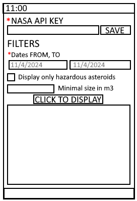
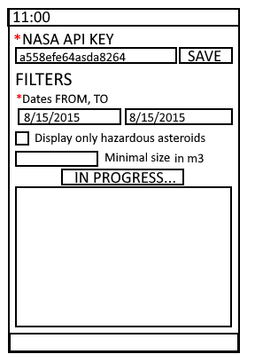
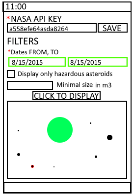
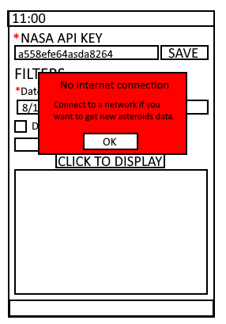

# Nasa Asteroid Visual - Softwarové požadavky

- Verze 1
- Autor: Daniel Vaško
- Datum: 4.11. 2024

## Obsah
1. [Úvod](#1-Úvod)

    1.1. [Účel](#11-Účel)

    1.2. [Cílová skupina](#12-Cílová-skupina)

    1.3. [Kontakty](#13-Kontakty)

2. [Celková hrubá architektura](#2-Celková-hrubá-architektura)

    2.1. [Zadání a uložení API klíče](#21-Zadání-a-uložení-API-klíče)

    2.2. [Zadání datumů](#22-Zadání-datumů)

    2.3. [Filtrování nebezpečných asteroidů](#23-Filtrování-nebezpečných-asteroidů)

    2.4. [Filtrování asteroidů dle velikosti](#24-Filtrování-asteroidů-dle-velikosti)

    2.5. [Zobrazení asteroidů](#25-Zobrazení-asteroidů)

3. [Hlavní moduly](#3-Hlavní-moduly)

    3.1. [Hlavní stránka](#31-Hlavní-stránka)

    3.2. [Získávání dat asteroidů](#32-Získávání-dat-asteroidů)

    3.3. [Zobrazení asteroidů](#33-Zobrazení-asteroidů)

    3.4. [Upozornění na chybu](#34-Upozornění-na-chybu)

## Historie dokumentu

| Verze | Datum | Autor          | Komentář                          |
|-------|-------|--------|-----------------------------------|
| 1     | 4.11. |Vasko Daniel    | První verze dokumentu            |

## 1. Úvod

### 1.1 Účel

Zobrazit vesmírné tělesa ve 2D zobrazení z daného datumu.

### 1.3 Cílová skupina

Tento dokument je určený pro ty, kdo se chtějí vidět vesmírná tělesa zachycená a poskytnutá od NASA API.

### 1.4 Kontakty

Mail: <vaskodaniel1@gmail.com>

## 2. Celková hrubá archiketura

### 2.1 Zadání a uložení API klíče
- Uživatel vloží svůj NASA API KEY a klikne SAVE, tím se jeho klíč uloží.

### 2.2 Zadání datumů
- Uživatel vloží datumy ve formátu "Měsíc/Den/Rok" a stane se jedna z 3 věcí:
1. Bude-li datum validní, okraj bude zelený
2. Bude-li datum nevalidní, okraj bude červený
3. Bude-li datum prázdný, okraj bude černý a automaticky nastavena na současné datum

### 2.3 Filtrování nebezpečných asteroidů
- Uživatel zaklikne zda chce vidět pouze nebezpečné asteroidy.

### 2.4 Filtrování asteroidů dle velikosti

- Uživatel zadá minimální velikost asteroidů, které chce vidět. Stane se jedna z 2 možností:

1. Zadaná hodnota je číslo a je tedy validní, okraj bude zelený
2. Pokusí-li se uživatel zadat jakýkoliv jinný znak než 0 až 9, hodnota se nezmění

### 2.5 Zobrazení asteroidů

- Uživatel zaklikne tlačítko "CLICK TO DISPLAY" a stane se jedna z 3 věcí:

1. API klíč má funkční a tedy počká než se mu zobrazí v poli pod tlačítkem vyfiltrované asteroidy s planetami.
2. API klíč není validní a dostane upozornění, že jeho klíč není validní.
3. Nemá připojení k internetu a dostane upozornění.
4. Dojde k limitu v průběhu získávání dat, uživatel dostane upozornění a vše co se stihlo získat za data se zobrazí.

## 3 Hlavní moduly

### 3.1 Hlavní stránka

- Při prvním otevření bez uloženého API klíče bude vypadat stránka takto.

### 3.2 Získávání dat asteroidů

- Při prvním otevření bez uloženého API klíče bude vypadat stránka takto.

### 3.3 Zobrazení asteroidů

- Po vyplnění všech vyžadovaných polí, kliknutí na zobrazení a vyčkání bude aplikace vypadat takto.

### 3.4 Upozornění na chybu

- V případě, že nastane chyba zobrazí se uživateli takovéto upozornění, kde text nahoře bude titulek, níže pod tím menším písmem popis a dále tlačítko pro odkliknutí.

